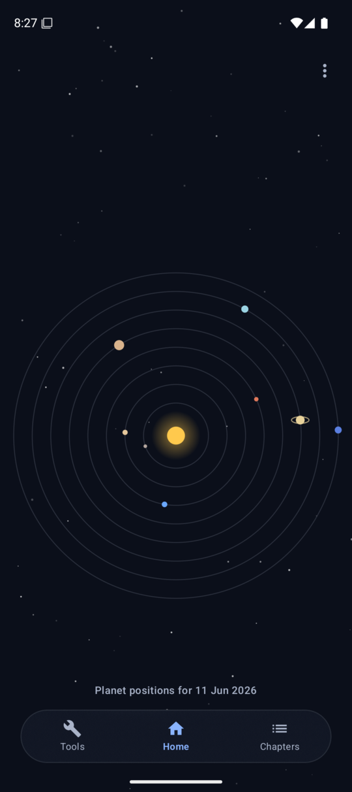
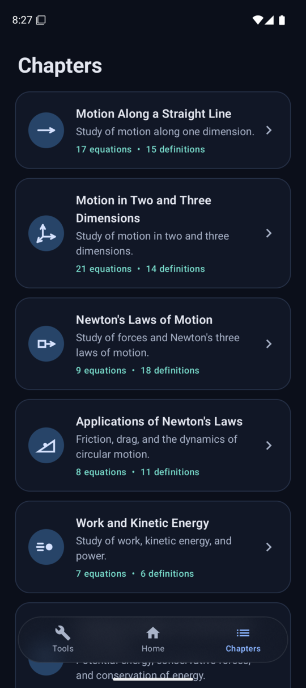
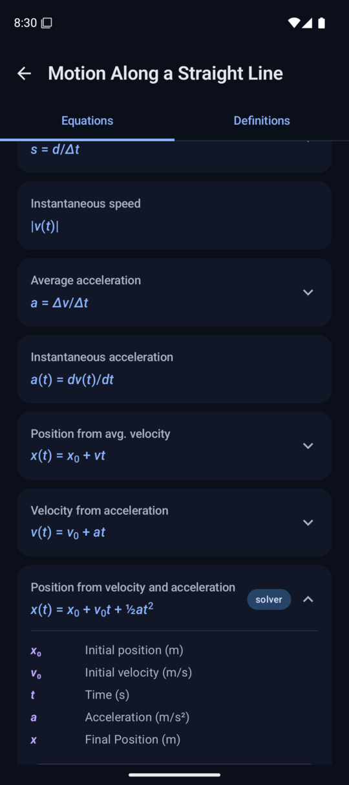
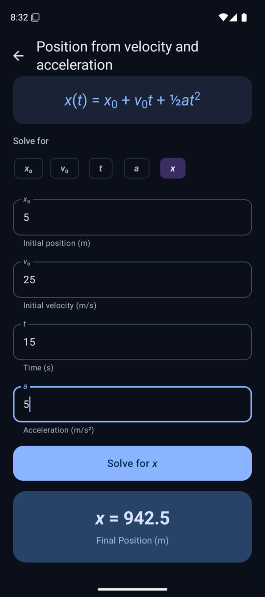
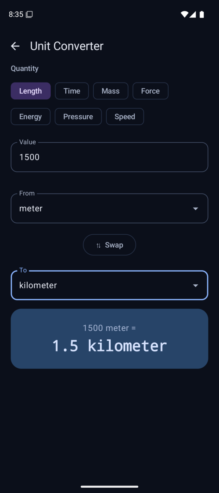
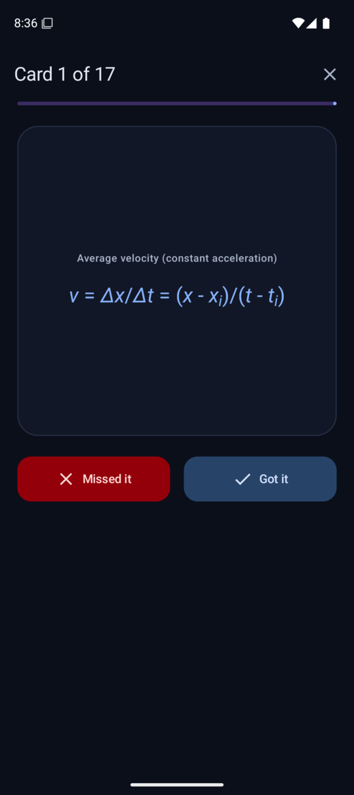
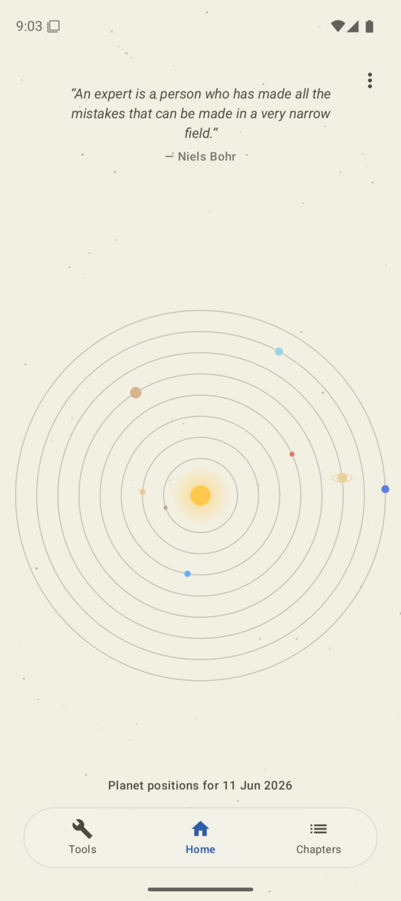
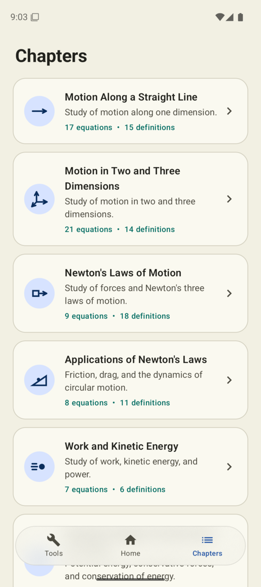

# Physicalc

An interactive physics reference and equation solver for first-year undergraduate students, built with Kotlin Multiplatform and Compose Multiplatform. One shared codebase runs natively on **Android** and **desktop** (Linux/macOS/Windows).


## Origin

Physicalc is the mobile/desktop evolution of my earlier project, [Physics-TUI](https://github.com/ClaudioRMalvino/Physics-TUI), a terminal user interface covering 12 chapters of first-year physics with 190+ equations, 58 interactive calculators, and a unit converter. The TUI works great if you live in a terminal, but most students live on their phones.

This project ports that work to a modern Material 3 app: the Python domain logic (equations, definitions, solvers, unit conversions) is being translated chapter-by-chapter into Kotlin, validated against the same test suites, and given a touch-first UI with the things a terminal can't offer such as: animated navigation, live-as-you-type unit conversion, and a proper on-screen experience for working through problems.

## Who it's for

First-year undergraduate physics students (and anyone reviewing the fundamentals). The content follows the openly licensed [OpenStax University Physics Volume 1](https://openstax.org/details/books/university-physics-volume-1) textbook:

- **Equation reference** per chapter, with every variable defined and its units stated
- **Interactive solvers** — pick the variable you want, fill in the rest, get the answer with proper error handling (no real roots, division by zero, negative time, etc.)
- **Definitions** — the key terms of each chapter in plain language
- **Unit converter** — length, time, mass, force, energy, pressure, and speed, converting live as you type

## Screenshots

|                                                                Home                                                                | Chapters | Equations |
|:----------------------------------------------------------------------------------------------------------------------------------:|:---:|:---:|
|  |  |  |

| Equation solver | Unit converter | Flashcards |
|:---:|:---:|:---:|
|  |  |  |

|                                                Light theme                                                | |
|:---------------------------------------------------------------------------------------------------------:|:---:|
|  |  |

Each planet in the home screen is drawn at its true
heliocentric ecliptic longitude for the current date (JPL Keplerian elements,
Kepler's equation solved by Newton's method). Orbital radii are compressed to
fit a phone; the angles are accurate.

## Porting status

| Chapter | Topic | Status |
|---|---|---|
| 3 | Motion Along a Straight Line | ✅ Ported (with tests) |
| 4 | Motion in Two and Three Dimensions | ✅ Ported (with tests) |
| 5 | Newton's Laws of Motion | ✅ Ported (with tests) |
| 6 | Applications of Newton's Laws | ✅ Ported (with tests) |
| 7 | Work and Kinetic Energy | ✅ Ported (with tests) |
| 8 | Potential Energy and Conservation of Energy | ✅ Ported (with tests) |
| 9 | Linear Momentum and Collisions | ✅ Ported (with tests) |
| 10 | Fixed-Axis Rotation | ✅ Ported (with tests) |
| 11 | Angular Momentum | ✅ Ported (with tests) |
| 12 | Static Equilibrium and Elasticity | ✅ Ported (with tests) |
| 13 | Gravitation | ✅ Ported (with tests) |
| 14 | Fluid Dynamics | ✅ Ported (with tests) |
| — | Unit Converter | ✅ Ported (with tests) |


## Architecture

```
PhysicsApp/
├── shared/                      # Kotlin Multiplatform module (all platforms)
│   └── src/
│       ├── commonMain/kotlin/io/github/claudiormalvino/physicalc/
│       │   ├── physics/         # Domain layer: chapters, equations, solvers, unit converter
│       │   │   ├── PhysicsModels.kt    # Equation / Definition / PhysicsChapter
│       │   │   ├── Chapter3.kt         # One file per chapter
│       │   │   ├── ChapterRegistry.kt  # Add a chapter here and the UI picks it up
│       │   │   └── UnitConverter.kt
│       │   ├── ui/              # Compose Multiplatform UI (Material 3, shared by all targets)
│       │   └── App.kt           # Navigation
│       └── commonTest/          # Test suites ported from Physics-TUI
├── androidApp/                  # Android entry point + launcher icon
└── desktopApp/                  # Desktop (JVM) entry point
```

The design principle carried over from Physics-TUI: **domain logic is pure and UI-free.** Every solver is a plain function from known values to the unknown, so it's trivially testable and platform-independent. Calculators follow the same convention as the Python original — the variable left unknown (`null`, formerly `None`) is the one solved for.

## Building and running

Prerequisites: JDK 17+, and for Android an SDK (the project reads its location from `local.properties`).

```bash
# Desktop — fastest way to try it
./gradlew :desktopApp:run

# Run the test suite
./gradlew :shared:jvmTest

# Android debug APK
./gradlew :androidApp:assembleDebug
# then install on a device/emulator:
# adb install androidApp/build/outputs/apk/debug/androidApp-debug.apk

# Signed release bundle for the Play Store (requires keystore.properties)
./gradlew :androidApp:bundleRelease
```

## Testing

Every calculation ported from Physics-TUI brings its test suite with it, ensuring the Kotlin produces the same results as the validated Python. Tests run on the JVM with `./gradlew :shared:jvmTest`.

## License

This project is licensed under the MIT License — see the [LICENSE](LICENSE) file for details.

## Acknowledgments

- Physics content referenced from the [OpenStax University Physics Volume 1](https://openstax.org/details/books/university-physics-volume-1) open-source textbook
- Built with [Kotlin Multiplatform](https://kotlinlang.org/docs/multiplatform.html) and [Compose Multiplatform](https://www.jetbrains.com/compose-multiplatform/)
- Predecessor project: [Physics-TUI](https://github.com/ClaudioRMalvino/Physics-TUI), built with [Textual](https://textual.textualize.io/)
